# nfunc-mcp

[](https://www.npmjs.com/package/nfunc-mcp) [](https://badge.socket.dev/npm/package/nfunc-mcp/0.5.1)

A local MCP server that gives Claude a non-functional QA toolkit. Performance,
accessibility, SEO, code quality and real-user Core Web Vitals — run
individually or all at once, returned as prioritised findings you can act on
rather than raw tool output.

> **[Operating manual →](docs/manual.md)** — installation options, per-tool
> reference, output shapes, troubleshooting.

---

## What it does

| Capability | Tools | What it checks |
|---|---|---|
| Performance | Lighthouse | LCP, TTI, TBT, CLS, bundle size, caching |
| Accessibility | Lighthouse + pa11y | WCAG 2 AA violations, ARIA, contrast, labels |
| SEO | Lighthouse | Crawlability, robots.txt, meta, link text |
| Best practices | Lighthouse | HTTPS, deprecated APIs, third-party cookies |
| Code quality | ESLint | Dead code, undeclared vars, swallowed errors |
| Security patterns | Semgrep | Code-level patterns in what you wrote |
| Supply chain | Trivy | Dependency CVEs, committed secrets, Dockerfile and IaC misconfiguration |
| Real-user vitals | PageSpeed Insights + CrUX | What actual visitors experienced, versus what the lab measures |

Findings arrive prioritised **P1 / P2 / P3**, written as defect-ticket prose
rather than audit jargon, with passing checks filtered out. Nothing that passes
is ever reported.

---

## Quick start

```bash
claude mcp add nfunc-mcp -- npx -y nfunc-mcp
```

Then install whichever CLIs you need — `lighthouse`, `pa11y`, `eslint`,
`semgrep`, `trivy`. Missing tools are skipped rather than fatal, so start with
what you have. Trivy also wants a one-time database download
(`trivy fs --download-db-only`, ~113 MB) before its first scan. For real-user
field data, add a
[PageSpeed Insights key](docs/manual.md#pagespeed-insights-api-key).

Verify with `/mcp`, then ask Claude to *"call the nfunc-mcp ping tool."*

[Other install options →](docs/manual.md#install-and-register)

---

## The tools

| Tool | What it does |
|---|---|
| **`run_qa_gate`** | **The one to reach for.** Runs everything applicable in parallel, correlates findings across tools, and returns a release verdict, a composite score, a per-tool scorecard and an HTML report. |
| `run_lighthouse` | Lighthouse for **one URL, a list, or a CSV**. `form_factor: "both"` finds device-specific defects the single profiles miss. |
| `run_accessibility_check` | pa11y WCAG audit for **one URL, a list, or a CSV**. Findings are priced by **WCAG 2.1 conformance** — Level A failures are P1 because they put an AA claim out of reach. `runner: "axe"` for ARIA and design systems. |
| `run_static_analysis` | ESLint + Semgrep over a local codebase. Uses your ESLint config if it finds one. |
| `run_security_scan` | Trivy over a local codebase — dependency CVEs, committed secrets, IaC misconfiguration. Vulnerabilities are grouped into **one finding per version bump**, not one per CVE, and ranked on how cheaply they can be fixed rather than on raw severity. CVEs with no upstream fix go to a separate decision queue instead of blocking the work queue. |
| `plan_performance_audit` | Plans a PageSpeed Insights audit — finds your URLs, groups them into page templates, costs the run. **Spends no quota.** |
| `run_performance_audit` | Runs it. Lab scores, real-user field data, and the disagreements between them. |
| `ping` | Health check. |

### How they connect



When Lighthouse and pa11y flag the same WCAG technique, `run_qa_gate` merges
the two findings, promotes the result one tier and marks it
`confidence: "high"`. `run_security_scan` stands alone for now.

### Which one when

- **Shipping something?** `run_qa_gate`. It is the default answer.
- **One dimension in depth?** The individual tool — `run_lighthouse` for a perf
  regression, `run_accessibility_check` for an a11y pass.
- **"Is the site actually fast for real people?"** The PSI pair. This is the
  only thing here that measures real visitors instead of a simulation, and it
  routinely disagrees with the lab.

The PSI tools are **opt-in** — `run_qa_gate` never calls them, because they
spend API quota and take minutes rather than seconds.

---

## How to ask for it

```
# Full suite
QA snapshot — https://myapp.com, code at /path/to/repo

# URL only (Lighthouse + pa11y)
QA snapshot — https://myapp.com

# Local branch only (ESLint + Semgrep)
QA snapshot — /path/to/my-feature-branch
```

These all work too:

```
Health check on https://myapp.com
Is https://myapp.com ready to ship? Code at /path/to/repo
Any red flags? /path/to/repo
Run Lighthouse on https://myapp.com for mobile and desktop
Run Lighthouse on these: https://a.com, https://b.com, https://c.com
Run an accessibility check on https://myapp.com using the axe runner
Run an accessibility check on every URL in ./top-pages.csv
Scan http://localhost:3000 and compare it to ./a11y-baseline
Plan a PageSpeed Insights audit for https://myapp.com
```

`run_qa_gate` returns a `report_file` path — open it in a browser for the
visual dashboard.

---

## What makes it different from running the CLIs yourself

**Findings, not output.** Every result is a prioritised defect with QA-native
prose and traceable evidence, not a wall of audit JSON.

**Cross-tool corroboration.** When Lighthouse and pa11y independently flag the
same accessibility gap, the finding is merged, promoted a tier and marked
`confidence: "high"`. Two tools agreeing is stronger evidence than either alone.

**Hand it a list, not a URL.** `run_lighthouse` and `run_accessibility_check`
both take a single URL, a comma-separated list, or a path to a CSV — and work
out which you gave them. Multiple URLs run as a resumable batch that writes each
report to disk and finishes with a cross-page rollup.
[How batching works →](docs/manual.md#auditing-several-urls-at-once)

**Systemic collapse, twice over.** One duplicate-id component failing on eleven
elements is reported as one defect, not eleven. And across a set of pages, a
rule failing on 4 of 4 is flagged as shared-layout — one fix in the header
clears every page, which is a different job from fixing one page's own bug.
[How that works →](docs/manual.md#run_accessibility_check)

**WCAG conformance, not a violation count.** Every accessibility finding maps
to a WCAG 2.1 success criterion and says what it costs your claim. A Level A
failure is P1 — not because it feels worse, but because while it stands, Level
AA conformance is *unreachable* no matter how the other criteria score. Each run
returns a conformance verdict counting failing **criteria**, not findings: "22
issues" and "5 criteria failing" are answers to different questions, and only
one of them goes in a compliance statement.
[How →](docs/manual.md#wcag-conformance-and-priority)

**Before versus after.** Point either tool at a previous run with
`baseline_dir` and it reports what you **fixed**, what **still fails**, and what
you **newly introduced** — plus score deltas. A violation count can't tell those
apart: on a real test, adding an `aria-label` fixed five P1s and introduced an
`aria-valid-attr-value` P2, because the `aria-labelledby` pointed at a missing
id. Works against `localhost`, so it's a pre-PR check.
[How →](docs/manual.md#comparing-two-runs-before-vs-after)

**Lab versus field.** A metric that passes in the lab but fails for real users
means your test environment is not reproducing production — and no local tool
can detect it. On one real homepage the lab reported a perfect CLS of 0 while
70% of real users were experiencing a rating of poor.
[More →](docs/manual.md#what-psi-adds-over-run_lighthouse)

---

## Priority levels

| | Meaning |
|---|---|
| **P1** | Blocker — fix before shipping |
| **P2** | Warning — track before merging |
| **P3** | Advisory — log as tech debt |

Priority is derived, not guessed. Accessibility findings follow **WCAG 2.1
conformance** — a Level A failure is P1 because it puts an AA claim out of
reach. Lighthouse findings are ranked by the category points an audit actually
costs, not by score alone. Semgrep `security` findings are P1 regardless of the
severity Semgrep assigned them.

Corroborated and field-confirmed findings are promoted a tier; lab-only
findings that real users don't experience are demoted.
[Full mapping →](docs/manual.md#priority-system)

---

## Docs

| | |
|---|---|
| [Operating manual](docs/manual.md) | Install, per-tool reference, output shapes, troubleshooting |
| [PSI report spec](docs/psi-report-spec.md) | How to turn a PSI audit into a written report |

MIT-compatible ISC licence. Issues and PRs welcome at
[Hiddensound/NFunc_MCP](https://github.com/Hiddensound/NFunc_MCP).
